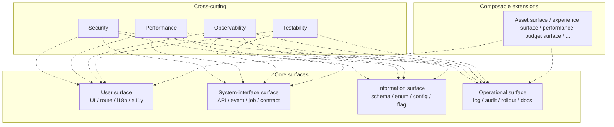
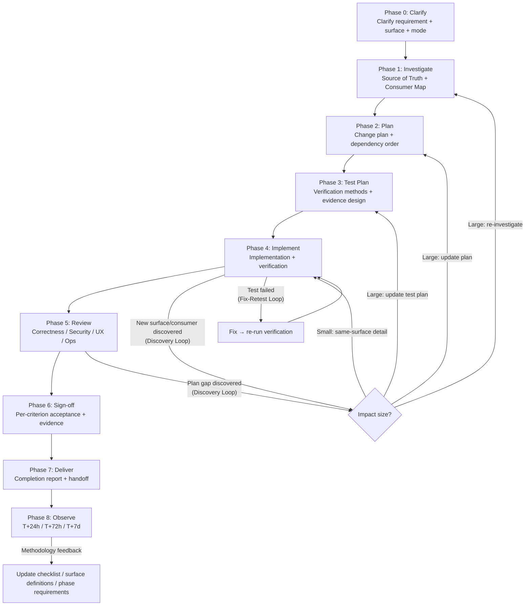
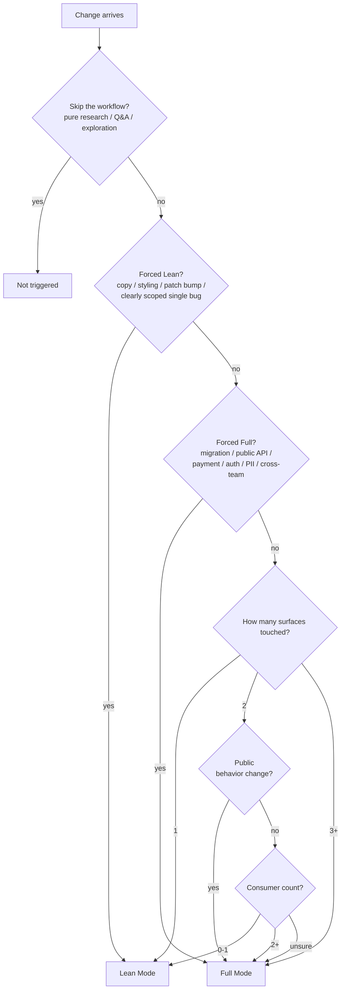
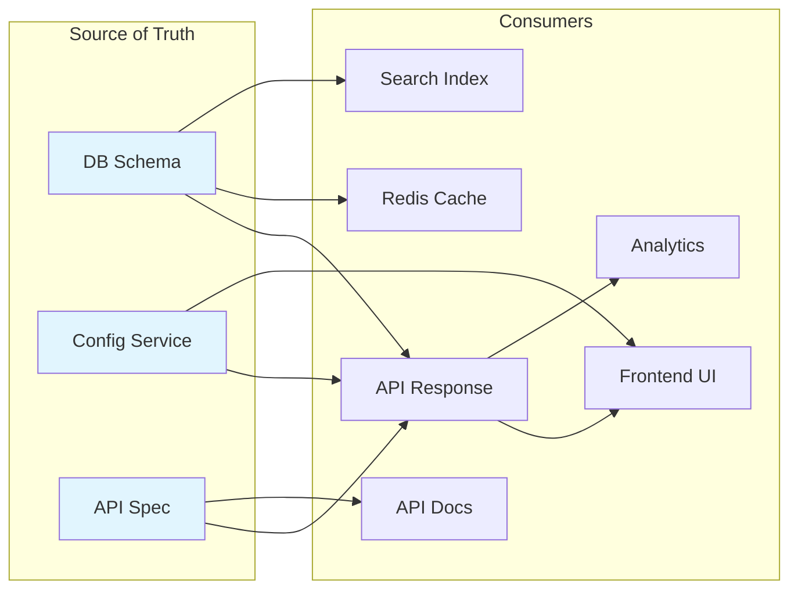
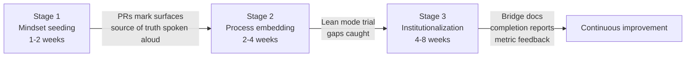
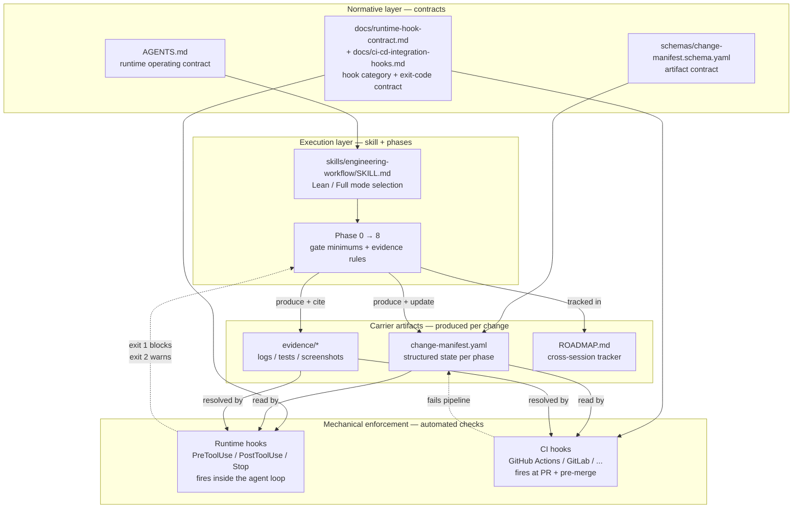

# Visual Overview

> **English TL;DR**
> Mermaid diagrams that visualize the methodology's core shapes, for readers who prefer pictures to prose. Six diagrams: (1) **four surfaces + cross-cutting concerns** mesh, (2) **nine-phase pipeline** (Phase 0-8) with Discovery Loop + Fix-Retest Loop, (3) **Lean / Full mode decision tree** anchored on surface count, consumer count, and forced triggers, (4) **source-of-truth relationships** — how contracts, DBs, and configs fan out to their consumers, (5) **team adoption stages** (mindset → process → institutionalization), (6) **all-pieces-together stack map** connecting the contract layer, execution layer, carrier artifacts, and mechanical guardrails (runtime hooks + CI hooks). Non-normative — use these to onboard new team members or to anchor workshop discussions; the text files remain authoritative.

This document presents the methodology's core structure as Mermaid diagrams to lower the reading barrier.

---

## 1. Four surfaces and their relationship to cross-cutting concerns

---

## 2. Phase 0→8 full flow (including the Discovery Loop and Fix-Retest Loop)

---

## 3. Lean / Full mode decision tree

---

## 4. Source of Truth and consumer relationships

---

## 5. Team adoption — three stages

---

## 6. All pieces together — how the layers connect

The methodology has four layers: a **normative layer** (what you must do), an **execution layer** (how you do it), a **carrier artifact layer** (what you produce), and a **mechanical-enforcement layer** (what catches you when you skip a step). This diagram shows how they plug together so a reader can see the full stack on one page.

**How to read this diagram.**

- The **normative layer** is spec-only; nothing there produces artifacts. It answers "what must be true."
- The **execution layer** operationalizes the contract through mode selection and phase gates. It answers "in what order do I work."
- The **carrier layer** is where all state lives between phases and between sessions. The Change Manifest is the single connecting artifact — every phase reads and updates it; every hook reads it.
- The **enforcement layer** has two tiers: runtime hooks catch failures *while the agent can still correct* (cheap), CI hooks catch failures *before they ship* (authoritative). Both share the same `0 = pass / 1 = block / 2 = warn` exit-code contract and the same manifest-as-input shape.

The dashed arrows back into the execution and carrier layers show the **feedback direction**: when a guard fires, the fix happens inside the phase loop, not in the guard. Hooks do not edit manifests — they refuse to let incomplete ones proceed.

See also: [`AGENTS.md`](../AGENTS.md) §7 (multi-agent), [`docs/runtime-hook-contract.md`](./runtime-hook-contract.md), [`docs/ci-cd-integration-hooks.md`](./ci-cd-integration-hooks.md), [`schemas/change-manifest.schema.yaml`](../schemas/change-manifest.schema.yaml), [`examples/starter-repo/`](../examples/starter-repo/) for a working end-to-end instantiation.

---

## How to use these diagrams

- New-hire onboarding → start with diagram 6 (stack map) for the big picture, then diagram 2 (phase flow) and diagram 3 (mode decision).
- Every task start → consult diagram 3 to choose mode; consult diagram 1 to confirm surface coverage.
- During Phase 1 investigation → use diagram 4 as a template for building your own source-of-truth map.
- Team rollout → use diagram 5 to explain adoption cadence to stakeholders.
- Explaining the plugin to a skeptical reviewer or stakeholder → diagram 6 shows, in one frame, where every mechanism lives and why each layer is necessary.
