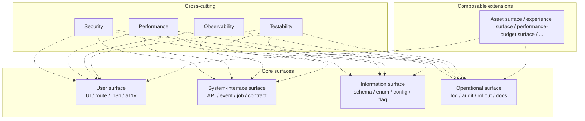
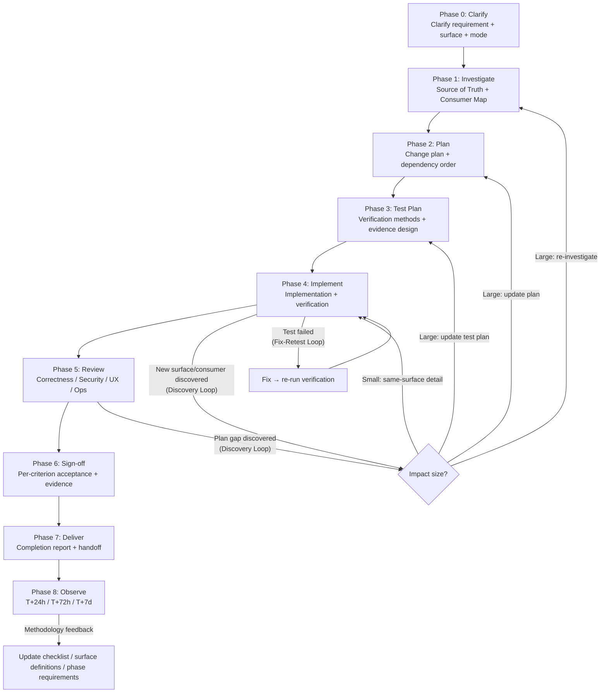
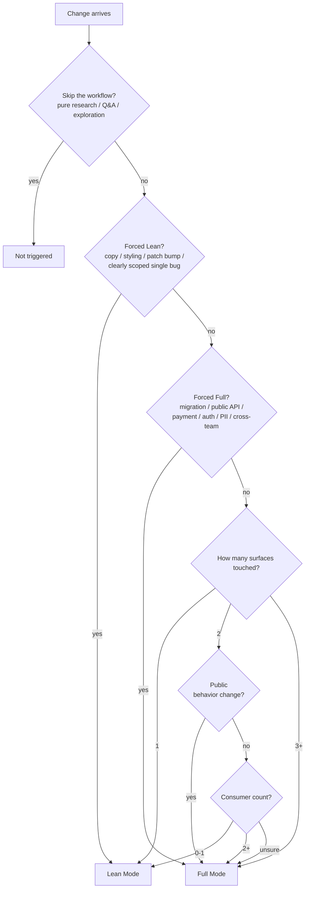
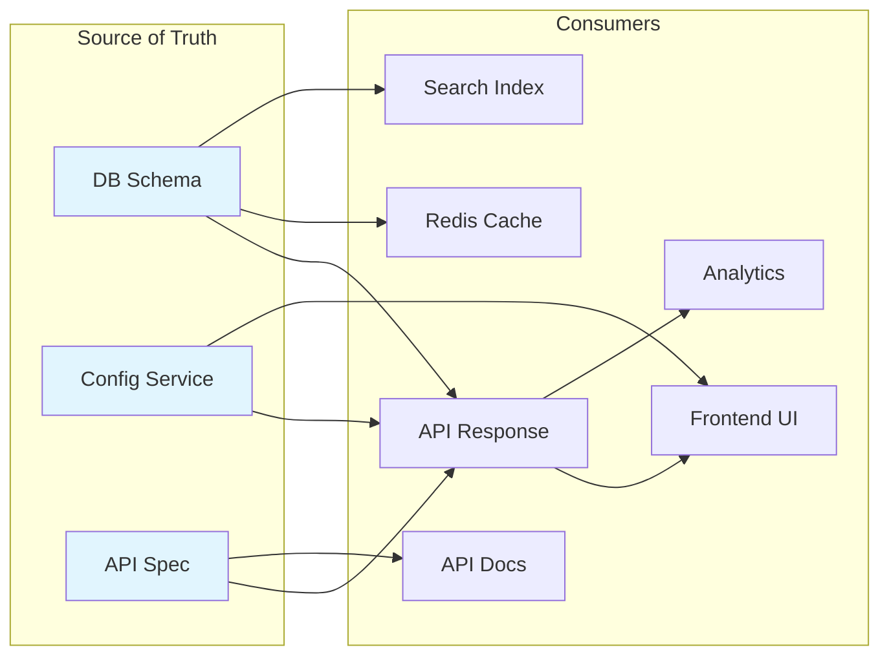
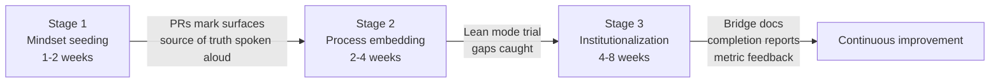

# Visual Overview

> **English TL;DR**
> Mermaid diagrams that visualize the methodology's core shapes, for readers who prefer pictures to prose. Six diagrams: (1) **four surfaces + cross-cutting concerns** mesh, (2) **nine-phase pipeline** (Phase 0-8) with decision gates, (3) **SoT pattern taxonomy** showing which pattern covers which kind of asset, (4) **breaking change severity × migration path** decision tree, (5) **rollback mode selection** flow (mode 1 reversible / 2 forward-fix / 3 compensation), (6) **agent handoff** (Planner → Implementer → Reviewer) with the Change Manifest as the carrier artifact. Non-normative — use these to onboard new team members or to anchor workshop discussions; the text files remain authoritative.

This document presents the methodology's core structure as Mermaid diagrams to lower the reading barrier.

---

## 1. Four surfaces and their relationship to cross-cutting concerns

---

## 2. Phase 0→8 full flow (including the Discovery Loop and Fix-Retest Loop)

---

## 3. Lean / Full mode decision tree

---

## 4. Source of Truth and consumer relationships

---

## 5. Team adoption — three stages

---

## How to use these diagrams

- New-hire onboarding → start with diagram 2 (phase flow) and diagram 3 (mode decision).
- Every task start → consult diagram 3 to choose mode; consult diagram 1 to confirm surface coverage.
- During Phase 1 investigation → use diagram 4 as a template for building your own source-of-truth map.
- Team rollout → use diagram 5 to explain adoption cadence to stakeholders.
